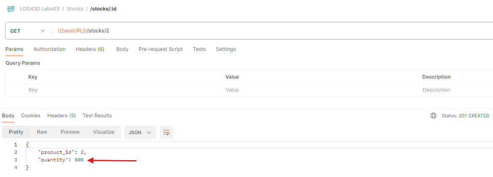

# Labo 03 — Rapport

 \
Jean-Christophe Benoit \
Rapport de laboratoire \
LOG430 — Architecture logicielle \
Montréal, le 3 octobre 2025 \
École de technologie supérieure

> J'ai crée ce PDF en utilisant le gabarit markdown (.md).

## Questions

### Question 1

> Quel nombre d'unités de stock pour votre article avez-vous obtenu à la fin du test ? Et pour l'article avec id=2 ? Veuillez inclure la sortie de votre Postman pour illustrer votre réponse.

Lors de l'exécution des _smoke tests_, je n'avais pas besoin d'avoir l'application python déployée sur docker, mais je devais avoir le conteneur _mysql-1_ qui fonctionne.

Après avoir exécuté ceux-ci, le nombre d'unités de stock de l'arrticle est le même qu'au début (après la création de l'article et l'ajout du stock). Dans mon cas, ce sera toujours 5 dû à la variable `add_stock_qty`. Cependant cette valeur est changeable, au besoin :

```python
# 2. Ajoutez 5 unités au stock de cet article (`POST /stocks`)
add_stock_qty = 5
add_stock_body = {'product_id': data.get('product_id'), 'quantity': add_stock_qty}
```

Si on démarre le conteneur de l'application python, on peut voir que le nombre d'unités de stock de l'article avec id = 2 est de 500 :


### Question 2

> Décrivez l'utilisation de la méthode join dans ce cas. Utilisez les méthodes telles que décrites à Simple Relationship Joins et Joins to a Target with an ON Clause dans la documentation SQLAlchemy pour ajouter les colonnes demandées dans cette activité. Veuillez inclure le code pour illustrer votre réponse.

Dans ce cas, nous faisons un join de la table Stock et la table Product, voulant dire que nous allons chercher les champs `product_id` et `quantity` de la table Stock et les champs `name`, `sku` et `price` de la table Product, mais seulement pour les lignes où le champ `product_id` de la table Stock est égale au champ `id` de la table Product. Dans la première partie de l'appel, on décrit les champs qu'on veut avoir comme résultat et dans la deuxième on décrit comment fusionner les deux tables

```python
results = session.query(
    Stock.product_id,
    Stock.quantity,
    Product.name,
    Product.sku,
    Product.price
).join(Product, Stock.product_id==Product.id)
```

Cet appel de fonction serait l'équivalent de la requête SQL suivante :

```sql
SELECT stock.product_id, stock.quantity, product.name, product.sku, product.price
FROM stock
JOIN product ON stock.product_id = product.id
```

### Question 3

> Quels résultats avez-vous obtenus en utilisant l’endpoint POST /stocks/graphql-query avec la requête suggérée ? Veuillez joindre la sortie de votre requête dans Postman afin d’illustrer votre réponse.

Sans aucun changement au code, la réponse de ce endpoint est la suivante :

```json
{
  "data": {
    "product": null
  },
  "errors": null
}
```

Cependant, après avoir fait une requête POST sur les stocks, redis est synchronisé et le résultat est le suivante :

```json
{
  "data": {
    "product": {
      "id": 1,
      "quantity": 5
    }
  },
  "errors": null
}
```

Cela est parce que la synchronisation de redis avec MySQL se fait seulement lors d'une opération qui ajoute une commande ou une quantité d'article dans MySQL :

```python
def set_stock_for_product(product_id, quantity):
  """Set stock quantity for product in MySQL"""
  session = get_sqlalchemy_session()
  try:
      result = session.execute(
          text(f"""
              UPDATE stocks
              SET quantity = :qty
              WHERE product_id = :pid
          """),
          {"pid": product_id, "qty": quantity}
      )
      response_message = f"rows updated: {result.rowcount}"
      if result.rowcount == 0:
          new_stock = Stock(product_id=product_id, quantity=quantity)
          session.add(new_stock)
          session.flush()
          session.commit()
          response_message = f"rows added: {new_stock.product_id}"

      r = get_redis_conn()
      r.hset(f"stock:{product_id}", "quantity", quantity)
```

```python
def add_order_to_redis(order_id, user_id, total_amount, items):
  """Insert order to Redis"""
  r = get_redis_conn()
  r.hset(
      f"order:{order_id}",
      mapping={
          "user_id": user_id,
          "total_amount": float(total_amount),
          "items": json.dumps(items)
      }
  )
```

### Question 4

> Quelles lignes avez-vous changé dans update_stock_redis? Veuillez joindre du code afin d’illustrer votre réponse.

J'ai dû modifier la ligne qui enregistre la valeur `name` pour prendre la valeur directement du `product_data`, et ajouter les lignes pour enregistrer les valeurs `sku` et `price` de `product_data`:

```python
def resolve_product(self, info, id):
  """ Create an instance of Product based on stock info for that product that is in Redis """
  redis_client = get_redis_conn()
  product_data = redis_client.hgetall(f"stock:{id}")
  if product_data:
      return Product(
          id=id,
          name=product_data['name'],
          quantity=int(product_data['quantity']),
          sku=product_data['sku'],
          price=float(product_data['price'])
      )
  return None
```

Ensuite, dans la méthode `update_stock_redis`, j'ai ajouté les champs nécessaire lors de l'enregistrement du stock dans redis :

```python
pipeline.hset(f"stock:{product_id}", f"quantity:{new_quantity}", f"name:{item['name']}", f"sku:{item['sku']}", f"price:{item['price']}")
```

### Question 5

> Quels résultats avez-vous obtenus en utilisant l’endpoint POST /stocks/graphql-query avec les améliorations ? Veuillez joindre la sortie de votre requête dans Postman afin d’illustrer votre réponse.

Voici le retour de la requête GrapQL après l'amélioration :

```json
{
  "data": {
    "product": {
      "id": 1,
      "name": "Laptop ABC",
      "price": 1999.99,
      "quantity": 1000,
      "sku": "LP12567"
    }
  },
  "errors": null
}
```

### Question 6

> Examinez attentivement le fichier docker-compose.yml du répertoire scripts, ainsi que celui situé à la racine du projet. Qu’ont-ils en commun ? Par quel mécanisme ces conteneurs peuvent-ils communiquer entre eux ? Veuillez joindre du code YML afin d’illustrer votre réponse.

Le docker network est ce qu'il leur permet de communiquer entre eux. Voici la partie de cahcun des fichier docker-compose.yml qui assure cette connexion :

```yaml
networks:
  labo03-network:
    driver: bridge
    external: true
```

## Observations additionnelles

### Configuration CI/CD

Le workflow de GitHub Actions s'exécute sur un self hosted runner qui se trouve sur la machine virtuelle de l'école.

La pipeline de CI met en place les services MySQL et Redis, installe les dépendances, et exécute les tests python.

Ensuite, l'application est déployée à l'aide de `docker compose` et elle est accessible via l'adresse IP de ma machine virtuelle (10.194.32.206) au port 5000

### Problèmes rencontrés

- N/A
